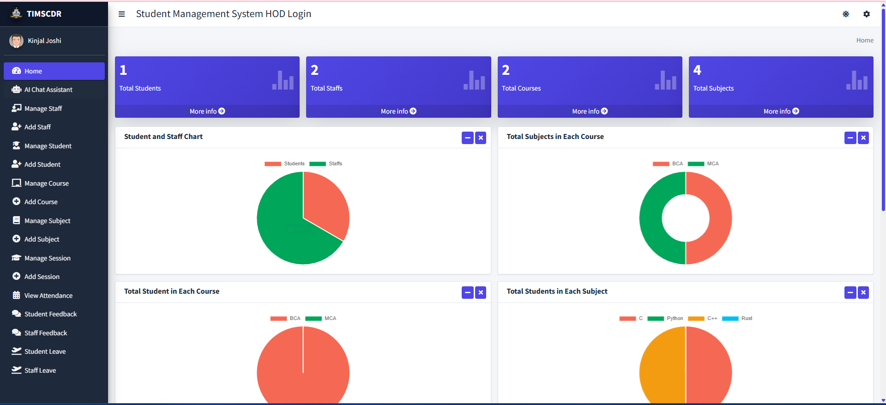
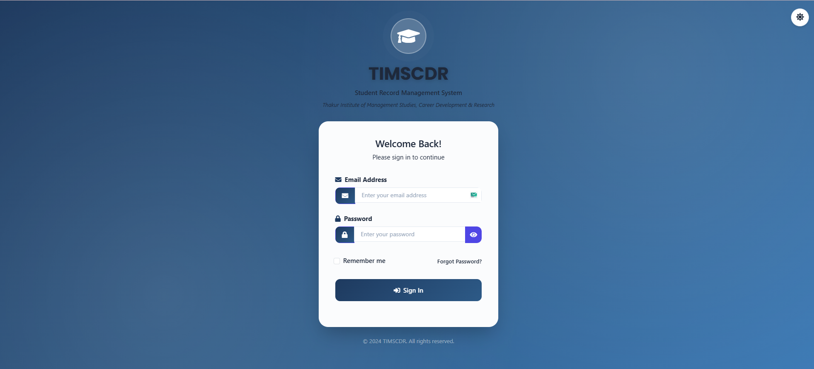
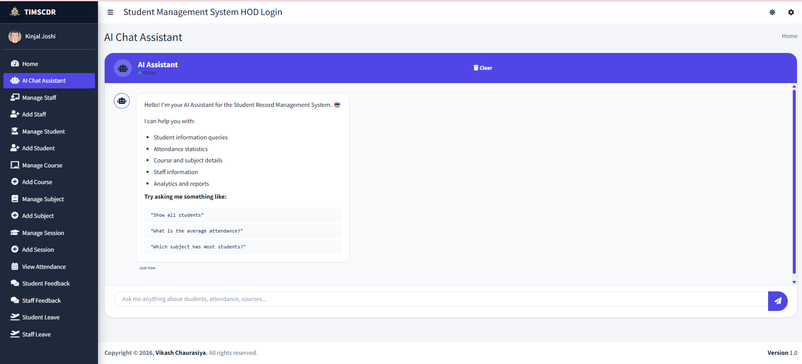

# 🎓 SRMS - Student Record Management System


A scalable and intelligent **Student Record Management System (SRMS)** built using **Django**, designed to automate and simplify academic administration.
This project enhances traditional management systems with **modern UI, secure authentication, and AI-powered insights**.

---

## 📌 Project Overview

Managing student records, attendance, and academic performance manually is inefficient and error-prone.
This system provides a **centralized digital platform** for:

* 📊 Academic performance tracking
* 🧑‍🏫 Staff and student management
* 📅 Attendance monitoring
* 🤖 Intelligent data querying using AI

---

## 📸 Screenshots

### Dashboard


### Login Page


### AI Chatbot


---

## 🚀 Core Features

### 👨‍💼 Admin (HOD)

* Dashboard with analytics and performance insights
* Manage Students, Staff, Courses, Subjects, Sessions
* Monitor attendance and academic progress
* Approve/Reject leave requests
* Review and respond to feedback
* Access AI chatbot for quick insights

---

### 👨‍🏫 Staff / Teachers

* Manage student attendance
* Add and update results
* Apply for leave
* Send feedback to admin
* View student-related analytics

---

### 👨‍🎓 Students

* View attendance and academic results
* Apply for leave
* Send feedback
* Access personal dashboard

---

## 🆕 My Contributions & Enhancements

This project has been **significantly upgraded** with modern features and intelligent capabilities:

### 🎨 UI/UX Improvements

* Redesigned the interface for a cleaner and more intuitive experience
* Improved navigation and responsiveness across all modules

---

### 🔐 Authentication System Upgrade

* Implemented **Forgot Password functionality** for all users
* Secure password reset using token-based verification
* Improved login reliability and user experience

---

### 🌗 Theme Toggle Feature

* Added **Dark/Light mode switching**
* Persistent user preference for better accessibility

---

### 🤖 AI Chatbot System (Key Innovation)

One of the most impactful enhancements is the integration of an **AI-powered chatbot** for administrative intelligence.

#### 🔍 Technical Design:

* Built a **natural language query interface** for HOD (Admin)
* Processes user input using **NLP-based logic**
* Maps queries to backend database operations

#### ⚙️ How It Works:

1. User enters query in natural language
2. System processes input using keyword/NLP techniques
3. Query is converted into Django ORM/database queries
4. Results are fetched and displayed in a readable format

#### 💡 Example Queries:

* *"Show students with low attendance"*
* *"List top-performing students"*
* *"Display staff workload"*

#### 📊 Capabilities:

* Real-time student performance analysis
* Attendance-based insights
* Staff activity tracking
* Instant administrative reporting

#### 🚀 Impact:

* Eliminates manual data searching
* Saves time for administrators
* Introduces **intelligent decision support system**

---

## ⚙️ Installation & Setup

### 🔧 Prerequisites

* Python 3.x
* pip
* Git

---

### 📥 Steps to Run Locally

```bash
git clone https://github.com/Vikash97600/SRMS_Latest.git
cd SRMS_Latest

python -m venv venv
venv\Scripts\activate   # Windows

pip install -r requirements.txt

python manage.py migrate
python manage.py runserver
```

---

## 🔐 Default Credentials (Optional)

| Role    | Email                                         | Password      |
| ------- | --------------------------------------------- | ------------- |
| Admin   | [admin@gmail.com](mailto:admin@gmail.com)     | admin@97600   |
| Staff   | [shweta@gmail.com](mailto:shweta@gmail.com)   | shweta        |
| Student | [vikash@gmail.com](mailto:vikash@gmail.com)   | vikash@97600  |

---

## 🛠️ Tech Stack

* **Backend:** Django (Python)
* **Frontend:** HTML, CSS, JavaScript
* **Database:** SQLite / MySQL
* **AI/NLP:** Custom chatbot (query-based NLP processing)

---

## 📂 Project Structure

```
SRMS/
│── manage.py
│── db.sqlite3
│── app/
│── templates/
│── static/
│── screenshots/
```

---

## 🚧 Future Enhancements

* Advanced AI analytics dashboard
* REST API integration
* Email/SMS notification system
* Mobile responsiveness improvements
* Role-based access APIs

---

## 📜 License

This project is licensed under the **MIT License**.
You are free to use, modify, and distribute it.

---

## 🙏 Acknowledgment

This project is based on an open-source Student Management System and has been **extensively enhanced with new features, improved UI, and AI capabilities**.

---

## ⭐ Support

If you find this project useful, consider giving it a ⭐ on GitHub!
